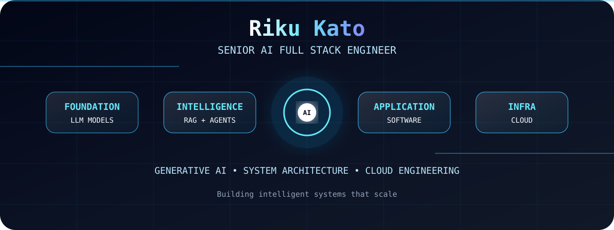

github icon code

<table>
 <tr>
    <td align="center" width="90">
      
       React
    </td>
    <td align="center" width="90">
      
       Next.js
    </td>
    <td align="center" width="90">
      
       Vue
    </td>
    <td align="center" width="90">
      
       Nuxt.js
    </td>
    <td align="center" width="90">
      
       Angular
    </td>
    <td align="center" width="90">
      
       Express
    </td>
    <td align="center" width="90">
      
       Laravel
    </td>
    <td align="center" width="90">
      
       WordPress
    </td>
    <td align="center" width="90">
      
       Django
    </td>
  </tr>
  <tr>
    <td align="center" width="90">
      
       Python
    </td>
    <td align="center" width="90">
      
       Javascript
    </td>
    <td align="center" width="90">
      
       Typescript
    </td>
    <td align="center" width="90">
      
       PHP
    </td>
    <td align="center" width="90">
      
       Ruby
    </td>
    <td align="center" width="90">
      
       MongoDB
    </td>
    <td align="center" width="90">
      
       MySQL
    </td>
    <td align="center" width="90">
      
       PostgreSQL
    </td>
    <td align="center" width="90">
      
       Supabase
    </td>
  </tr>
  <tr>
    <td align="center" width="90">
      
       Flutter
    </td>
    <td align="center" width="90">
      
       Android
    </td>
    <td align="center" width="90">
      
       MaterialUI
    </td>
    <td align="center" width="90">
      
       Tailwind
    </td>
    <td align="center" width="90">
      
       Three.js
    </td>
    <td align="center" width="90">
      
      FastAPI
    </td>
    <td align="center" width="90">
      
       Java
    </td>
    <td align="center" width="90">
      
       .NET
    </td>
    <td align="center" width="90">
      
       Rust
    </td>
  </tr>

 <tr>
     <td align="center" width="90">
       
        Firebase
     </td>
     <td align="center" width="90">
       
        Bootstrap
     </td>
     <td align="center" width="90">
       
        AWS
     </td>
     <td align="center" width="90">
       
        Azure
     </td>
     <td align="center" width="90">
       
        Docker
     </td>
     <td align="center" width="90">
       
       Go
     </td>
     <td align="center" width="90">
       
        npm
     </td>
     <td align="center" width="90">
       
        Sass
     </td>
     <td align="center" width="90">
       
        Kotlin
     </td>
   </tr>

<tr>
     <td align="center" width="90">
       
        Swift
     </td>
     <td align="center" width="90">
       
        Spring
     </td>
     <td align="center" width="90">
       
        Android Studio
     </td>
     <td align="center" width="90">
       
        Cloudflare
     </td>
     <td align="center" width="90">
       
        Flask
     </td>
     <td align="center" width="90">
       
       Rails
     </td>
     <td align="center" width="90">
       
        GraphQL
     </td>
     <td align="center" width="90">
       
        Cypress
     </td>
     <td align="center" width="90">
       
        Linux
     </td>
   </tr>

</table>

